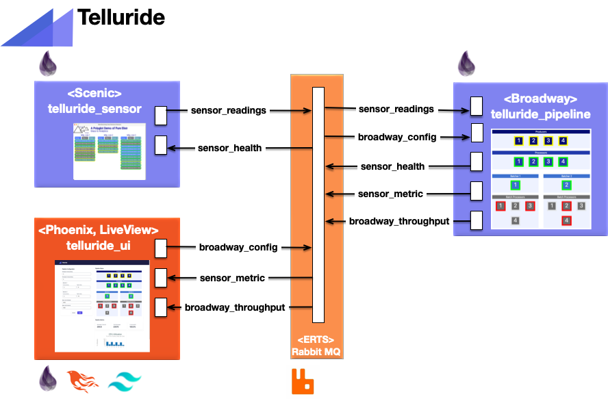

## Alan Strait

ERTS / Erlang / OTP / Elixir is a destination technology.

Telluride is a set of three public repositories that collaborate through Rabbit MQ to exercise and observe Broadway, an Elixir data ingestion and data processing pipeline library.  The below image depicts how messages flow between instances of these three repositories.

The purpose of Telluride is to have an example that visualizes the results of batch processing sensor data as well as the effect of changing configuration on identifying bottlenecks and monitoring throughput.

<!--
**alanStrait/alanStrait** is a ✨ _special_ ✨ repository because its `README.md` (this file) appears on your GitHub profile.

Here are some ideas to get you started:

-  Hi there 👋
- 🔭 I’m currently working on ...
- 🌱 I’m currently learning ...
- 👯 I’m looking to collaborate on ...
- 🤔 I’m looking for help with ...
- 💬 Ask me about ...
- 📫 How to reach me: ...
- 😄 Pronouns: ...
- ⚡ Fun fact: ...
-->
